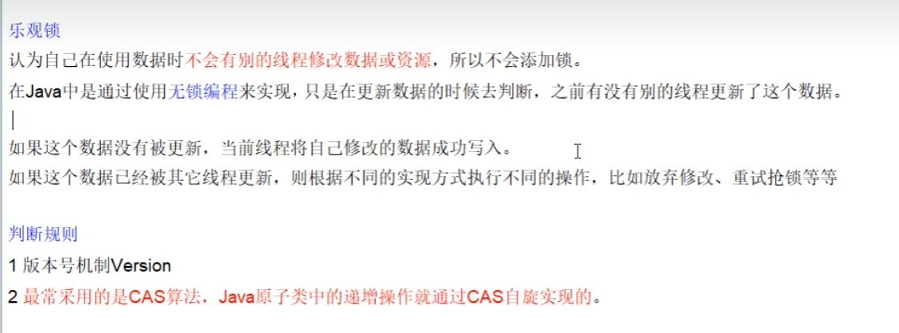
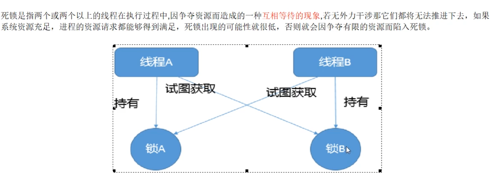
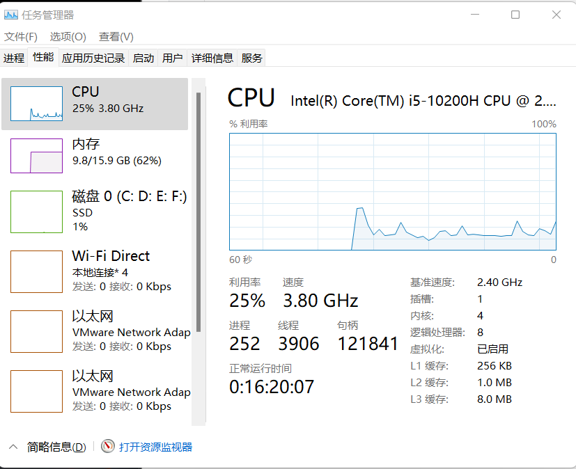
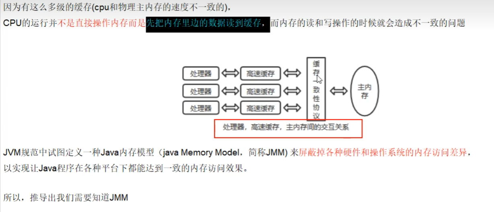

[TOC]


# 1、初识

```
JUC  java.util.concurrent
```


## 1.1、第一个程序

```java
public class Test01 {
    public static void main(String[] args) {
        new Thread(() -> {
            System.out.println("hello world");
        }, "text").start();
    }
}
```

> ```
> 调用start()方式，实际上是调用start0()方法
> 	private native void start0(); // 底层是 c 操作系统多线程
> ```


```java
public synchronized void start() {
    if (threadStatus != 0)
        throw new IllegalThreadStateException();
    group.add(this);

    boolean started = false;
    try {
        start0();
        started = true;
    } finally {
        try {
            if (!started) {
                group.threadStartFailed(this);
            }
        } catch (Throwable ignore) {
        }
    }
}
```


## 1.2、java多线程相关概念

```
1把锁：
	synchronized
	
2个并：
	并发（concurrent）：一台处理器处理多个任务
	并行（parallel）：多台处理器上同时处理多个任务
	
3个程：
	进程：一个应用程序
	线程：一个程序会有多个线程
	管程：（Monitor）监视器，也就是我们平时说的锁，是一种同步机制，保证同一时间只有一个线程可以访问被保护的数据和代码
	
	JVM中同步是基于进入和退出监视器对象Monitor来实现的，【每个对象实例都会有一个Monitor对象】
	Monitor对象会和Java对象同一时间创建和销毁，底层是c++实现
```


## 1.3、守护线程和用户线程

```
用户线程（User Thread）

守护线程（Daemon Thread）
	守护线程作为一个服务线程，当用户线程结束，守护线程会自动结束(gc)

isDaemon()   true 守护线程， false 用户现场

setDaemon(boolean) set为守护线程(true)或者用户线程(false)
```


```
setDaemon()在start()之前调用
	否则抛出IllegalThreadStateException异常
```


```java
public class Test01 {
    public static void main(String[] args) {
        Thread thread = new Thread(() -> {
            while (true) {
                System.out.println(Thread.currentThread().getName() + "hello");
            }
        }, "text");
        thread.setDaemon(true);
        thread.start();
        for (int i = 0; i < 10; i++) {
            System.out.println(
                    Thread.currentThread().getName()+i
            );
        }
    }
}
```


# 2、CompletableFuture

```java

public class CompletableFuture<T> implements Future<T>, CompletionStage<T>

public interface RunnableFuture<V> extends Runnable, Future<V>

public class FutureTask<V> implements RunnableFuture<V>
```


## 2.1、Future接口

```
Future接口（FutureTask实现）定义了操作异步任务执行一些方法，如获取异步任务的执行结果，取消任务的执行，判断任务是否被取消，判断任务是否执行完毕
```

```
Future可以为主线程开启一个分支任务，专门处理主线程费时费力的任务
```


### 2.1.1、FutureTask实现

Callable接口

```java
class MyCallable implements Callable<String> {
    @Override
    public String call() throws Exception { // 异常
        return "hello";
    }
}
```


FutureTask实现类

```java
public FutureTask(Callable<V> callable) {
        if (callable == null)
            throw new NullPointerException();
        this.callable = callable;
        this.state = NEW;       // ensure visibility of callable
    }

public FutureTask(Runnable runnable, V result) {
        this.callable = Executors.callable(runnable, result);
        this.state = NEW;       // ensure visibility of callable
    }
```


Demo

```java
public static void main(String[] args) throws Exception {
        FutureTask<String> futureTask = new FutureTask<>(new MyCallable());
        Thread thread = new Thread(futureTask);
        thread.start();
        String str = futureTask.get();
        System.out.println("str:"+str); // 获取返回值
    }
```


### 2.1.2、Future结合线程池


```java
public static void main(String[] args) throws Exception {
    // 线程池
    ThreadPoolExecutor threadPoolExecutor = new ThreadPoolExecutor(
            5,
            10,
            10,
            TimeUnit.SECONDS,
            new LinkedBlockingDeque<>(10),
            Executors.defaultThreadFactory(),
            new ThreadPoolExecutor.AbortPolicy()
    );
    // 创建FutureTask任务
    FutureTask<String> futureTask = new FutureTask<>(() -> {
        return "hello FutureTask";
    });
    threadPoolExecutor.submit(futureTask);// submit( Runnable task )
    String s = futureTask.get();
    System.out.println(s);
    threadPoolExecutor.shutdown();
}
```


### 2.1.3、Future缺点

```
	任务比较耗时时
	get()方法容易阻塞，一定要等到计算结果才会离开

```

```java

String s = futureTask.get(3, TimeUnit.SECONDS);// get( long timeout, TimeUnit unit ) // 如果3s内没有得到结果，抛出超时异常 TimeoutException
```


```
轮询耗费CPU
```

```java
while (true){
    if(futureTask.isDone()){ // 判断是否执行完
        System.out.println(futureTask.get());
        System.out.println("over");
        break;
    }else {
        TimeUnit.SECONDS.sleep(3);
        System.out.println("执行中");
    }
}
```


> ```
> Future获取结果只能通过阻塞或者轮询得到
> ```


## 2.2、CompletableFuture


### 2.2.1、CompleteableFuture对Future的改建

```
对于真正的异步处理我们希望是可以通过传入回调函数，在Future结束时自动调用该回调函数，这样，我们就不用等待结果。
```


```java
public class CompletableFuture<T> implements Future<T>, CompletionStage<T>
```


### 2.2.2、CompletableFuture的四大静态方法


```java
public static CompletableFuture<Void> runAsync(Runnable runnable) // 无返回值
public static CompletableFuture<Void> runAsync(Runnable runnable,
                                                   Executor executor)
    
public static <U> CompletableFuture<U> supplyAsync(Supplier<U> supplier)// 有返回值
public static <U> CompletableFuture<U> supplyAsync(Supplier<U> supplier,
                                                       Executor executor)

// 不指定线程，使用默认的线程池 ForkJoinPool
```


```java
public interface Supplier<T> {

    /**
     * Gets a result.
     *
     * @return a result
     */
    T get();
}
```


```java
CompletableFuture<Void> voidCompletableFuture = CompletableFuture.runAsync(()->{
    System.out.println("runAsync  runnable");
}); // Runnable 接口
ExecutorService executorService = Executors.newFixedThreadPool(5);
CompletableFuture<Void> voidCompletableFuture1 = CompletableFuture.runAsync(()->{// Runnable 接口
    System.out.println("runAsync  runnable");

}, executorService); // Runnable 接口, Executors线程池
executorService.shutdown();
```


```java
CompletableFuture<Object> objectCompletableFuture1 = CompletableFuture.supplyAsync(()->{
    return "hello CompletableFuture";
});
System.out.println(objectCompletableFuture1.get()); // 获取返回值
CompletableFuture<Object> objectCompletableFuture2 = CompletableFuture.supplyAsync(() -> {
    return "hello CompletableFuture";
},executorService); // 指定线程池
System.out.println(objectCompletableFuture2.get()); // 获取返回值
```


### 2.2.3、Code

```java
public CompletableFuture<T> whenComplete(
        BiConsumer<? super T, ? super Throwable> action)
    
public interface BiConsumer<T, U> 
    void accept(T t, U u);


```


```java
CompletableFuture<String> objectCompletableFuture;
try {
    objectCompletableFuture = CompletableFuture.supplyAsync(() -> {
        try {
            TimeUnit.SECONDS.sleep(5);
        } catch (InterruptedException e) {
            e.printStackTrace();
        }
        String result = "hello";
        return result;
    }, executorService).whenComplete((result, exception) -> { // 当任务完成时
        System.out.println(executorService);
        System.out.println(executorService);
        if (exception == null) { // 没有异常
            System.out.println("没有异常，得到结果");
            System.out.println(Thread.currentThread().getName() + ":whenComplete:" + result);
        }
    }).exceptionally(exception -> { // 异常处理
        System.out.println("异常");
        return null;
    });
} catch (Exception e) {
    e.printStackTrace();
} finally {
    executorService.shutdown();
}
```


### 2.2.4、join 获取返回值

```java
public static void main(String[] args) {
    CompletableFuture<String> stringCompletableFuture = CompletableFuture.supplyAsync(() -> {
        try {
            TimeUnit.SECONDS.sleep(5);
        } catch (InterruptedException e) {
            e.printStackTrace();
        }
        return "hello";
    });
    System.out.println(stringCompletableFuture.join()); // 获取返回值，没有异常
}
```


### 2.2.5、链式编程


```java
@AllArgsConstructor
@NoArgsConstructor
@Data
@Accessors(chain = true) // 链式
class Student {
    private String name;
    private Integer age;

    public static void main(String[] args) {
        Student student = new Student();
        student.setName("张三").setAge(18); // 链式编程
    }
}
```


### 2.2.6、CompletableFuture常用API

#### 2.2.6.1、获取结果和触发计算

```java
completableFuture.get(); // 抛出异常
completableFuture.get(2L, TimeUnit.SECONDS); // 超时时间
completableFuture.join(); // 等待结果 没有异常
completableFuture.getNow("dhf");  // 获取结果，没有结果时，返回默认值
```


```java
public boolean complete(T value) {
    boolean triggered = completeValue(value);
    postComplete();
    return triggered;
}
```

```java
boolean complete = completableFuture.complete("hello"); // 触发计算，打断get或join方法
```

```java
boolean complete = completableFuture.complete("hello"); // 触发计算，打断get或join方法
System.out.println(completableFuture.get()); // 获取的是 “hello”
```


#### 2.2.6.2、处理计算结果

```java
thenApply(Function<? super T,? extends U> fn)

    // 得到上一步的运算结果，进行 计算 返回
    
public <U> CompletableFuture<U> handle(
        BiFunction<? super T, Throwable, ? extends U> fn)
```


```java
// 2. 对计算结果进行处理
String completableFuture2 = CompletableFuture.supplyAsync(() -> {
    try {
        TimeUnit.SECONDS.sleep(3);
    } catch (InterruptedException e) {
        e.printStackTrace();
    }
    return "hello";
}).thenApply((result) -> {
    return result + 2;
}).get();
System.out.println(completableFuture2);
// thenApply由于相互依赖关系，当前步骤有异常就停
```


```java
val handle = CompletableFuture.supplyAsync(() -> {
    return "hello";
}).handle((result, exception) -> { // handle可以带这异常
    if (exception == null) {
        System.out.println(result);
    } else {
        exception.printStackTrace();
    }
    return "hello";
});
System.out.println(handle.get());

// 可以带着异常处理
```


#### 2.2.6.3、消费处理结果

```java
public CompletableFuture<Void> thenAccept(Consumer<? super T> action)
    // 消费结果，没有返回值

thenAccept() 任务A执行完后执行B，B需要A的结果
    
thenRun(Runnabler runnable)  任务A执行完后执行B，B不需要A的结果
    
thenApply(Function fn) 任务A执行完后执行B，B需要A的结果，B有返回值
```


```java
// 3 消费处理结果
        // null
System.out.println(CompletableFuture.supplyAsync(() -> "result").thenRun(()->{}).join());
        // null
System.out.println(CompletableFuture.supplyAsync(() -> "result").thenAccept(r->{}).join());
        // result
System.out.println(CompletableFuture.supplyAsync(() -> "result").thenApply(r->r).join());
```

备注

```java
thenRunAsync()  和 thenRun()区别

使用默认的线程池时：
    都会使用ForkJoinPool
    
当传入自定义线程池时：
thenRun()下一个任务和上一个任务使用的同一个线程池

thenRunAsync()下一个任务和上一个任务使用的不同的线程池
```


#### 2.2.6.4、对计算速度进行选择

```java
public <U> CompletableFuture<U> applyToEither(
    CompletionStage<? extends T> other, Function<? super T, U> fn) {
    return orApplyStage(null, other, fn);
}
```


```java
// 4 对计算速度进行选择

CompletableFuture<String> completableFuture1 = CompletableFuture.supplyAsync(() -> {
    return "playA";
});
CompletableFuture<String> completableFuture3 = CompletableFuture.supplyAsync(() -> "playB");
String winner = completableFuture1.applyToEither(completableFuture3, (result) -> {
    return result + " is win";
}).join();
```


#### 2.2.6.5、计算结果合并

```java
public <U,V> CompletableFuture<V> thenCombine(
        CompletionStage<? extends U> other,
        BiFunction<? super T,? super U,? extends V> fn) {
        return biApplyStage(null, other, fn);
    }
```

```java
// 5 对计算结果进行合并
        CompletableFuture<Integer> integerCompletableFuture = CompletableFuture.supplyAsync(() -> 1);
        CompletableFuture<Integer> integerCompletableFuture2 = CompletableFuture.supplyAsync(() -> 2);
        // 先完成的要等待后完成的结果
        Integer join = integerCompletableFuture.thenCombine(integerCompletableFuture2, (result, result2) -> {
            return result + result2;
        }).join();
        System.out.println(join);
```


# 3、线程锁


## 3.1、乐观锁和悲观锁

```
悲观锁：认为自己在使用数据的时候一定有别的线程来修改数据，因此在获取数据的时候会先加锁，确保数据不会被别的线程修改。
	synchronized关键字和Lock的实现类都是悲观锁
	
	适合写操作多的场景
```




```
乐观锁适合读操作多的场景
```


## 3.2、为什么任何一个对象都可以成为一个锁


> ```
> Object.java -> ObjectMonitor.java(cpp) -> VmObject.java(cpp)
> ```


```
每个对象都带有一个对象监视器，每一个被锁住的对象都会和monitor关联起来
```


## 3.3、公平锁和非公平锁


```java
class SaleTicketDemo {
    static class Ticket { // 资源类
        private int ticket = 50;
        ReentrantLock lock = new ReentrantLock(); // 非公平锁
        ReentrantLock lock1 = new ReentrantLock(true); // 公平锁
        public void sale(){
            while (true){
                lock.lock();
                try {
                    if (ticket > 0) {
                        System.out.println(Thread.currentThread().getName() + "正在卖第" + (ticket--) + "张票");
                        Thread.sleep(100);
                    }else {
                        System.out.println("票已卖完");
                        break;
                    }
                } catch (InterruptedException e) {
                    e.printStackTrace();
                } finally {
                    lock.unlock();
                }
            }
        }
    }
    static ExecutorService executorService = Executors.newFixedThreadPool(5);
    public static void main(String[] args) {
        Ticket ticket = new Ticket();
        for (int i = 0; i < 3; i++) { // 三个线程卖票
            executorService.execute(() -> {
                ticket.sale(); // 开始买票
            });
        }
    }
}
```


```
1
恢复挂起的线程到真正锁的获取还是有时间差的，从开发人员来看这个时间微乎其微，但是从CPU的角度来看，这个时间差存在的还是很明显的。所以非公平锁能更充分的利用CPU的时间片，尽量减少CPU空闲状态时间。
2
使用多线程很重要的考量点是线程切换的开销，当采用非公平锁时，当1个线程请求雠获取同步状态，然后释放同步状态，所以刚释放锁的线程在此刻再次获取同步状态的概率就变得非常大，所以就减少了线程的开销。

```


## 3.4、可重入锁（递归锁）


```java
// 可重用锁
class RecursionLock {
    static ExecutorService executorService = Executors.newFixedThreadPool(5);
    public static void main(String[] args) {
        final Object o = new Object();
        executorService.execute(()->{
            synchronized (o) {
                System.out.println("线程1");
                synchronized (o){
                    System.out.println("doSomeThing");
                }
            }
        }); 
    }
}
```


### 3.4.1、synchronized可重用锁机制


### 3.4.2、显式可重用锁锁Lock

> ```
> 调用几次，就要释放几次
> ```


```java
ReentrantLock lock = new ReentrantLock();
        executorService.execute(() -> {
            lock.lock(); // 计数器 +1 
            try {
                System.out.println("dosomething");
                lock.lock(); // 计数器 +1
                try {
                    System.out.println("dosome");
                }finally {
                    lock.unlock(); // 计数器 -1 
                }
            }finally {
                lock.unlock(); // 计数器 -1
            }

        });
```


## 3.5、死锁




排查死锁

```
jsp -l    # 查看java进程 java 	ps -ef

jstack 进程号 # 查看堆栈信息
```

```
jconsole
```


## 3.6、写锁（独占锁）/读锁（共享锁）

## 3.7、自旋锁SpinLock

## 3.8、无锁->独占锁->读写锁->邮戳所

## 3.9、无锁->偏向锁->轻量锁->重量所


# 4、LockSupport与线程中断


## 4.1、中断机制


## 4.2、中断三大方法

```
void interrupt() 中断这个线程
	仅仅设置线程的中断状态为true，发起一个协商而不会立刻停止线程
	
static boolean interrupted()  测试当前线程是否中断。
	判断是否被中断 并 清除当前中断状态（设置为false）
	
boolean isInterrupted()  测试这个线程是否被中断。
	检查中断标志
```


### 4.2.1、如何停止中断运行的线程

1、volatile关键字

```java
public class ThreadInterrupt {
    private volatile static boolean flag = true;
    private static ExecutorService executor = Executors.newFixedThreadPool(10);
    public static void main(String[] args) {
        executor.execute(() -> {
            while (flag) {
                System.out.println(Thread.currentThread().getName() + "正在执行");
                try {
                    Thread.sleep(1000);
                } catch (InterruptedException e) {
                    e.printStackTrace();
                }
            }
            System.out.println(Thread.currentThread().getName() + "结束执行"+"flag:"+flag);
        });

        executor.execute(() -> {
            try {
                TimeUnit.SECONDS.sleep(2);
            } catch (InterruptedException e) {
                e.printStackTrace();
            }
            flag = false; // 停止执行
        });

    }
}
```


2、AtomicBoolean

```java
class AtomicBooleanDemo { // 原子布尔型
    private static AtomicBoolean flag = new AtomicBoolean(true);
    private static ExecutorService executor = Executors.newFixedThreadPool(10);
    public static void main(String[] args) {
        executor.execute(() -> {
            while (flag.get()) {
                System.out.println(Thread.currentThread().getName() + "正在执行");
                try {
                    Thread.sleep(1000);
                } catch (InterruptedException e) {
                    e.printStackTrace();
                }
            }
            System.out.println(Thread.currentThread().getName() + "结束执行"+"flag:"+flag);
        });

        executor.execute(() -> {
            try {
                TimeUnit.SECONDS.sleep(2);
            } catch (InterruptedException e) {
                e.printStackTrace();
            }
            flag.set(false); // 停止执行
        });
    }
}
```


3、Thread自带API（interrupt，... ）


```java
public static void main(String[] args) throws Exception {
    Thread t1 = new Thread(() -> {
        while (true) {
            if (Thread.currentThread().isInterrupted()) { // 检查线程是否被中断
                System.out.println("线程被中断");
                break;
            }
            System.out.println("线程1执行" + Thread.currentThread().isInterrupted());
        }
        System.out.println("线程1结束执行");
    }, "t1");
    t1.start(); // 线程一开启
    new Thread(t1::interrupt).start(); // 线程二开启，并且协商中断线程一

    TimeUnit.SECONDS.sleep(2);
}
```

备注

```apl
interrupt() 中断线程，如果线程处于阻塞状态(sleep，wait,join等状态)
会打断线程的阻塞状态， 中断状态被清除，  抛出InterruptedException

中断不活动的线程没有任何作用
```


### 4.2.2、interrupt会立即中断线程吗


```apl
实例方法 interrupt()仅仅是设置线程的中断状态设置为false，不会停止线程
```


## 4.3、LockSupport


```apl
构造私有
```

```
LockSupport可以阻塞当前线程，并且可以唤醒指定线程。
```


### 4.3.1、awit，notify

```
wait和notify不能脱离synchronized使用
必须先 notify 后 wait
```


```java
public static void main(String[] args) throws InterruptedException {
    Object objectLock = new Object();
    new Thread(() -> {
        synchronized (objectLock){
            try {
                objectLock.wait();
            } catch (InterruptedException e) {
                e.printStackTrace();
            }
            System.out.println("线程1开始等待");
            System.out.println("线程1结束等待");
        }
    },"t1").start();
    TimeUnit.SECONDS.sleep(2);
    new Thread(()->{
        synchronized (objectLock){
            objectLock.notify();
            System.out.println("线程2发出");
        }
    },"t2").start();
}
```


### 4.3.2、await、signal

```
java.util.concurrent.locks.Condition

Condition中的线程等待一定要放在锁块中
先await后signal
```


```java
public static void main(String[] args) throws InterruptedException {
    ReentrantLock lock = new ReentrantLock();
    Condition condition = lock.newCondition(); // 获取监视器
    new Thread(() -> {
        lock.lock(); // 获取锁
        try {
            System.out.println("线程1开始等待");
            condition.await(); // 等待
            System.out.println("线程1结束等待");
        } catch (InterruptedException e) {
            e.printStackTrace();
        } finally {
            lock.unlock(); // 释放锁
        }
    }, "t1").start();
    TimeUnit.SECONDS.sleep(2);
    new Thread(() -> {
        lock.lock();
        condition.signal();
        System.out.println("线程2发出");
        lock.unlock();
    }, "t2").start();
}
```


### 4.3.3、park等待，unpark唤醒

```
    这个类与每个使用它的线程相关联，一个许可证（在Semaphore类的意义上）。 如果许可证可用，则呼叫park将park返回，在此过程中消耗它; 否则可能会阻止。 致电unpark使许可证可用，如果尚不可用。 （与信号量不同，许可证不能累积，最多只有一个。）
```


```java
public static void park() {
    UNSAFE.park(false, 0L);
}

public static void unpark(Thread thread) {
        if (thread != null)
            UNSAFE.unpark(thread);
    }
```


```java
public static void main(String[] args) throws InterruptedException {
    val thread = new Thread(() -> {
        System.out.println("线程1开始等待");
        LockSupport.park(); // 阻塞当前线程
        System.out.println("线程1结束等待");
    }, "t1");
    thread.start();
    TimeUnit.SECONDS.sleep(2);
    new Thread(()->{
        System.out.println("线程2发出");
        LockSupport.unpark(thread); // 唤醒线程1
    },"t2").start();
}
```


```
1、无锁块要求
2、可以先唤醒unpark后等待park（提起买好通行证）
```


## 4.4、LockSupport


```java
public static void main(String[] args) throws InterruptedException {
    val thread = new Thread(() -> {
        System.out.println("线程1开始等待");
        LockSupport.park(); // 阻塞当前线程
        LockSupport.park();
        System.out.println("线程1结束等待");
    }, "t1");
    thread.start();
    TimeUnit.SECONDS.sleep(2);
    new Thread(()->{
        System.out.println("线程2发出");
        LockSupport.unpark(thread); // 唤醒线程1
        LockSupport.unpark(thread);
    },"t2").start();
}
```


```
会阻塞，多次的unpark并没有用，因为许可证最多只能有一个，不会累计
```


# 5、Java内存模型JMM


## 5.1、计算机硬件








## 5.2、JMM（Java Memory Model）


```apl
  JMM(Java内存模型Java Memory Model，简称JMM)本身是一种抽象的概念并不真实存在它仅仅描述的是一组约定或规范，通过这组规范定义了程序中(尤其是多线程)各个变量的读写访问方式并决定一个线程对共享变量的写入何时以及如何变成对另一个线程可见，关键技术点都是围绕多线程的原子性、可见性和有序性展开的。I
原则:|
  JMM的关键技术点都是围绕多线程的  原子性、可见性和有序性   展开的
能干嘛?
  1、通过JMM来实现  线程 和 主内存 之间的抽象关系。·	
  2、屏蔽各个 硬件平台 和 操作系统 的内存访问差异以实现让Java程序在各种平台下都能达到一致的内存访问效果。

```


## 5.3、JMM三大特性

- 可见性：是指当一个线程修改了某一个共享变量的值，其他线程是否能够立即知道该变更，JMM规定了所有的变量都存储在主内存中.


```
系统主内存共享变量数据修改被写入的时机是不确定的，多线程并发下很可能出现"脏读"﹐所以每个线程都有自己的工作内存、线程自己的工作内存中保存了该线程使用到的变量的主内存副本拷贝，线程对变量的所有操作《（读取，赋值等）都必需在线程自己的工作内存中进行，而不能够直接读写主内存中的变量。不同线程之间也无法直接访问对方工作内存中的变量，线程间变量值的传递均需要通过主内存来完成
```


- 原子性：指一个操作是不可打断的，即多线程环境下，操作不能被其他线程干扰
- 有序性：对于一个线程的执行代码而言，我们总是习惯性认为代码的执行总是从上到下，有序执行。但为了提升性能，编译器和处理器通常会对指令序列进行重新排序。Java规范规定JVM线程内部维持顺序化语义，即只要程序的最终结果与它顺序化执行的结果相等，那么指令的执行顺序可以与代码顺序不一致，此过程叫指令的重排序。


```
优缺点
JVM能根据处理器特性（CPU多级缓存系统、多核处理器等）适当的对机器指令进行重排序，使机器指令能更符合CPU的执行特性，最大限度的发挥机器性能。但是，
指令重排可以保证串行语义一致，但没有义务保证多线程间的语义也一致(即可能产生"脏读")，简单说，两行以上不相干的代码在执行的时候有可能先执行的不是第一条，不见得是从上到下顺序执行，执行顺序会被优化。

```


## 5.4、缓存一致性


## 5.5、先行发生原则happens-before

1. 次序规则：一个线程内，按照代码顺序，写在前面的操作先行发生于写在后面的操作;
2. 锁定规则：一个unLock操作先行发生于后面((这里的“后面”是指时间上的先后))对同一个锁的lock操作;
3. volatile变量规则：对一个volatile变量的写操作先行发生于后面对这个变量的读操作，**前面的写对后面的读是可见的**，这里的“后面”同样是指时间上的先后。
4. 传递规则：如果操作A先行发生于操作B，而操作B又先行发生于操作c，则可以得出操作A先行发生于操作C;
5. 线程启动规则：Thread对象的start()方法先行发生于此线程的每一个动作
6. 线程中断规则：对线程interrupt()方法的调用先行发生于被中断线程的代码检测到中断事件的发生;
7. 线程终止规则：线程中的所有操作都先行发生于对此线程的终止检
   测，我们可以通过isAlive()等手段检测线程是否已经终止执行。
8. 对象方法：一个对象的初始化完成（构造函数执行结束）先行发生于它的finalize()方法的开始


# 6、volatile


## 6.1、volatile两大特点

1. 可见性
2. 有序性【禁重排】


```
    当写一个volatile变量时，JMM会把该线程对应的本地内存中的共享变量值立即刷新回主内存中。
    当读一个volatile变量时，JMM会把该钱程对应的本地内存设置为无效，重新回到主内存中读取最新共享变量所以volatile的写内存语义是直接刷新到主内存中，读的内存语义是直接从主内存中读取。

```


## 6.2、内存屏障


