 

[TOC]


# 1、NoSQL数据库

## 1.1 NoSQL数据库概述

NoSQL(NoSQL=Not Only SQL)

NoSQL不依赖业务逻辑方式存储，而已简单的key-value存贮

- 不遵循SQL标准
- 不支持ACID
- 远超SQL的性能

## 1.2 NoSQL适用场景

- 对数据高并发的读写
- 海量数据的读写
- 对数据高扩展性的

## 1.3 NoSQL不适应场景

- 需要事务支持
- 基于sql的结构化存储查询，出库复杂的关系

## 1.4 NoSQL数据库举例

- Memcache
- Redis【一般作为缓存使用】
- MongoDB【文档数据库】


## 2、Redis安装

- Redis是一个**开源的key-value**存储系统
- 和Memcached类似，它支持存储的value**类型相对更多**【string，list，set】
- 这些数据都支持，**push/pop，add/remove**及取**交集和差集**及更丰富的操作，而且这些操作都是**原子性的**
- 在此基础上，Redis支持各种不同方式的**排序**
- 与memcached一样，为了保证效率，数据都是缓存在**内存**中
- 区别是，Redis会**周期性**的把更新的数据写入磁盘或者把修改的操作写入追加的记录文件
- 并在此基础上实现了**master-slave**【主从】同步


## 2.1 虚拟机上面安装，启动，关闭

```
【linux启动
进入 /usr/local/bin目录
	redis-server /etc/redis.conf
关闭
	1、shutdown
    2、ps -ef|grep redis查找进程
    	kill -9 PID
】
```


## 2.2 Redis介绍相关知识

- Redis默认端口**6379**
- Redis默认16个数据库，默认使用第0个

```
C:\WINDOWS\system32>redis-server --service-stop【停止】
[18172] 02 Jul 13:45:30.129 # Redis service successfully stopped.

C:\WINDOWS\system32>redis-server --service-start【启动】
[8148] 02 Jul 13:45:34.406 # Redis service successfully started.

C:\WINDOWS\system32>redis-cli【连接】
127.0.0.1:6379> select 1【切换数据库】
OK
127.0.0.1:6379[1]> select 15
OK
127.0.0.1:6379[15]> select 0
OK
127.0.0.1:6379>
```

- 所有库统一密码管理


# 3、常用五大数据类型

## 3.1 Redis键（Key）

| 命令                | 作用                                   | 例子                                         |
| ------------------- | -------------------------------------- | -------------------------------------------- |
| keys *               | 查看当前库的所有key                    | 127.0.0.1:6379> keys *                       |
| exists key          | 判断某个key是否存在                    | 127.0.0.1:6379> EXISTS b<br/>(integer) 0     |
| type key            | 查看某个key是什么类型                  | 127.0.0.1:6379> TYPE menuCache<br/>hash      |
| del key             | 删除指定key数据                        | 直接删除                                     |
| unlink key          | 根据value选择非阻塞删除                | 真正的删除在后续异步操作                     |
| expire key secondex | 设置key过期时间                        | 127.0.0.1:6379> EXPIRE k1 10<br/>(integer) 1 |
| ttl key             | 查看改key过期时间,-1永不过期，-2已过期 | 127.0.0.1:6379> ttl k1<br/>(integer) -2      |
| select index        | 切换库                                 | select 15                                    |
| dbsize              | 查看库有多少key                        | 127.0.0.1:6379> DBSIZE<br/>(integer) 12      |
| flushdb             | 清空当前库                             |                                              |
| flushall            | 通杀全部库                             |                                              |


## 3.2 字符串String

### 3.2.1 字符串简介

String类型是二进制安全的，意味着Redis的string可以包含任何数据，比如jpg图片或者序列化的对象，一个Redis中字符串value最多可以是512M


### 3.2.2 常用命令


| 命令                   | 作用                                        | 实例                                                         |
| ---------------------- | ------------------------------------------- | ------------------------------------------------------------ |
| set key value          | 添加数据(设置相同的key，后者覆盖前者)       | 127.0.0.1:6379[15]> set k1 a<br/>OK                          |
| get key                | 取出数据                                    | 127.0.0.1:6379[15]> get k1<br/>"a"                           |
| append key value       | 追加数据                                    | 6379[15]> append k1 b<br/>(integer) 2<br/>6379[15]> get k1<br/>"ab" |
| strlen key             | 获取值的长度                                | [15]> strlen k1<br/>(integer) 2                              |
| setnx key value        | 只有key不存在时，设置key的值                | [15]> setnx k1 0<br/>(integer) 0【失败】                     |
| incr key               | 将key存储的数字值增 1，如果为空，新增值为1  |                                                              |
| decr key               | 将key存储的数字值减 1，如果为空，新增值为-1 |                                                              |
| incrby/decrby key 步长 | 将key中存储的数字增或减，自定义步长         |                                                              |

```
incr key对存储的指定key的数值执行操作
所谓原子性操作是指不会被线程调度机制打断的操作
这种操作一旦开始，就一直到运行结束，中间不会有任何context switch【切换到另一个线程】
【1】在单线程中，能够在单条指令中完成的操作都可以认为是原子性操作，因为中断只能发生于指令之间
【2】多线程中，不能被其他进程【线程】打断的操作就叫原子性操作
Redis单命令的原子性只要得益于Redis的单线程

```

| 命令                           | 作用                                        | 实例 |
| ------------------------------ | ------------------------------------------- | :--- |
| mset key1 value1 key2 value2   | 同时设置多个k-v对                           |      |
| mget key1 key2                 | 同时取一个或多个value                       |      |
| msetnx key1 value1 key2 value2 | 同时设置多个k-v对,当且仅当**所有key不存在** |      |
| getrange key start end         | 获取start到end的值                          |      |
| setrange key start value       | 用value覆写key所存储的字符串，从start开始   |      |
| setex key 过期时间 value       | 设置键值的同时，设置过期时间，单位s         |      |
| getset key value               | 设置新值，同时获取旧值                      |      |

### 3.2.3 结构

```
底层是一个双向链表
```


## 3.3 List列表

### 3.3.1 简介

```
单键多指
Redis列表是简单的字符串列表，按照插入顺序排序，可以添加一个元素到列表的头部或者尾部
底层是一个双向链表，对两端操作性能很高
```


### 3.3.2 命令

| 命令                                | 作用                                       | 实例                                                  |
| :---------------------------------- | :----------------------------------------- | :---------------------------------------------------- |
| lpush/rpush key v1 v2               | 从左边/右边插入一个或多个值                | [15]> lpush k1 a b c<br/>(integer) 3                  |
| lrange key start stop               | 从左边取，0，-1全部                        | [15]> lrange k1 0 -1<br/>1) "c"<br/>2) "b"<br/>3) "a" |
| lpop/rpop key                       | 从左边或者右边取出一个值，取出之后改值移除 | [15]> lpop k1<br/>"0"                                 |
| rpoplpush key1 key2                 | 从k1右边取出一个值插入k2左边               |                                                       |
| lindex key index                    | 按照索引下标获取元素                       | [15]> lindex k1 0<br/>"c"                             |
| llen key                            | 获取列表长度                               |                                                       |
| linsert key before/after value newV | 在value的前/后加一个newV                   |                                                       |
| lrem key n value                    | 从左边删除n个value值                       |                                                       |
| lset  key index value               | 将key的index的值变成value，替换            |                                                       |

### 3.2.3 结构

```
List的数据结构是一个快速列表,QuickList
在列表元素少的情况下使用一块连续的内存存储，这个结构是zipList【压缩列表】
将多个zipList用链表形式连接起来，形成quickList
```


## 3.3 Redis集合（set）

### 3.3.1 简介

```
Redis set和list类似，区别set是自动去重，且是无序的，底层是一个value为null的hash表
```


### 3.3.2 命令

| 命令                  | 作用                                     | 实例                                         |
| --------------------- | ---------------------------------------- | -------------------------------------------- |
| sadd key v1 v2        | 添加一个或者多个值到set中                | [15]> sadd k1 a b<br/>(integer) 2            |
| smembers key          | 取出该集合所有值                         | [15]> SMEMBERS k1<br/>1) "b"<br/>2) "a"      |
| sismember key v       | 判断集合key是否含有value                 | [15]> SISMEMBER k1 a<br/>(integer) 1         |
| scard key             | 返回该集合的元素个数                     | [15]> scard k1<br/>(integer) 2               |
| srem key v1 v2        | 删除集合中某个元素                       | [15]> SREM k1 a b<br/>(integer) 2            |
| spop key              | 随机从集合中吐出一个值，吐出后，该值移除 | [15]> spop k1<br/>"b"                        |
| srandmember key n     | 随机从集合中取出n个值，不会删除          | [15]> srandmember k1 2<br/>1) "c"<br/>2) "a" |
| smove key1 key2 value | 把key1中的一个值移动到key2               |                                              |
| sinter key1 key2      | 返回两个集合的交集元素                   |                                              |
| sunion key1 key2      | 返回两个集合的并集元素                   |                                              |
| sdiff key1 key2       | 返回两个几个的差集，key1中的，不包含key2 |                                              |


### 3.3.3 结构

```
set结构是dict字典，字典是用hash实现的
set内部也是hash结构
```


## 3.4 Redis哈希（Hash）

### 3.4.1 简介

```
Redis Hash是一个键值对集合
Redis Hash是一个string类型的field和value的映射表，hash特别适合用于存储对象，类似java中的Map<String,Object>
```


### 3.4.2 命令

| 命令                        | 作用                                                 | 实例 |
| --------------------------- | :--------------------------------------------------- | ---- |
| hset key field value        | 给key集合中的field字段赋值value                      |      |
| hget key field              | 从key集合中取出field字段的值                         |      |
| hmset key field v field v   | 批量插入hash值                                       |      |
| hexists key field           | 查看hash表中给定field是否存在                        |      |
| hkeys key                   | 列出该hash所有的field                                |      |
| hvals key                   | 列出该hash所有的value                                |      |
| hincrby key field increment | 将hash表为key的field字段加增量                       |      |
| hsetnx key field value      | 将key中field字段设置为value，当且仅当field字段不存在 |      |

### 3.4.3 结构

```
ziplist + hash
```


## 3.5 有序集合（zset）

### 3.5.1 简介

```
Redis zset的每个成员都关联了一个 评分【score】，这个频分被用来按照从最低到最高分的方式排序集合中的成员，集合中的成员是唯一的，但是评分是可以重复的
```


### 3.5.2 命令

| 命令                                         | 作用                                             |
| -------------------------------------------- | ------------------------------------------------ |
| zadd key score value score2 v2               | 将一个或者多个member元素及score加入key中         |
| zrange key start stop [withscore]            | 取出key中的值，0，-1取出全部,[withscore]包含评分 |
| zrangebyscore key min max [withscore]        | 返回有序集score介于min和max之间，闭区间          |
| z**rev**rangebyscore key max min [withscore] | 改为从大到小配许                                 |
| zincrby key incerment value                  | 为元素的score增加增量                            |
| zrem key value                               | 删除该集合下指定值的元素                         |
| zcount key min max                           | 统计集合分数区间的元素个数                       |
| zrank key value                              | 返回该值在集合中的排名，从0开始                  |


# 4、 配置文件

```
redis.windows.config

bind 127.0.0.1 # 仅支持本机连接

# protected-mode yes # 开启保护模式，不支持远程访问
protected-mode no

port 6379 # 端口

tcp-backlog 511

timeout 0 #超时时间，连接上redis若干秒不操作，超时

tcp-keepalive 300 # 检查连接

# NOT SUPPORTED ON WINDOWS daemonize no
daemonize yes # 后台启动

loglevel notice # 目录级别

logfile "" # 日志输出路径

databases 16 # 默认数据库数量

在 SECURITY中设置redis密码

# maxclients 10000 # 设置redis同时可以和多少个客户端连接默认10000个
```


# 5、Redis的发布和订阅

## 5.1 什么是发布和订阅

```
Redis发布和订阅【pub/sub】是一种消息通信模式：发送者【pub】发生消息，订阅者【sub】接收消息
Redis客户端可以订阅任意数量的频道
```


## 5.2 发布订阅命令实现

```
1.打开一个客户端订阅channell
subscribe channell
```

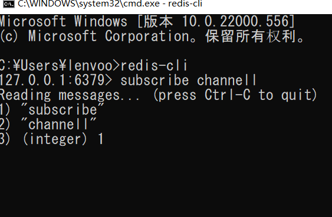


```
2.打开一个客户端，给channell发布消息hello
publish channell hello
```


```
3.返回第一个客户端可以看到发送的消息
```

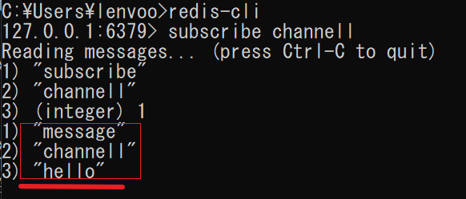


# 6、Redis6新数据类型

## 6.1 Bitmaps

### 6.1.1 简介

- Bitmaps本身不是一种数据类型，实际上他就是字符串（key-value），但是他可以对字符串的位进行操作
- Bitmaps单独提供了一套命令，所以Redis中使用Bitmaps和使用字符串的方法不太相同。可以把Bitmaps想象成一个以位为单位的数组，数组的每个单元只能存储0和1，数组的下标在Bitmaps中叫做偏移量


### 6.1.2 命令

【1】格式

```
setbit key offset value 设置Bitmaps中某个偏移量的值（0/1）
```

offset偏移量

```
127.0.0.1:6379[15]> setbit users 1 1
(integer) 0
```

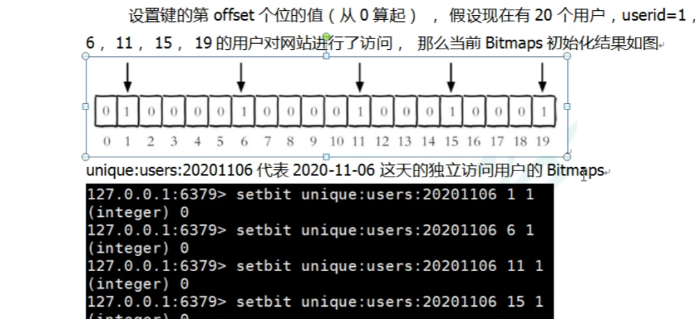


| 命令                    | 作用                       | 实例                                 |
| ----------------------- | -------------------------- | ------------------------------------ |
| getbit key offset       | 取出键的第offest的值       | [15]> getbit users 0<br/>(integer) 1 |
| bitcount key[start end] | 统计字符串被设置为1的bit数 | [15]> bitcount users<br/>(integer) 2 |

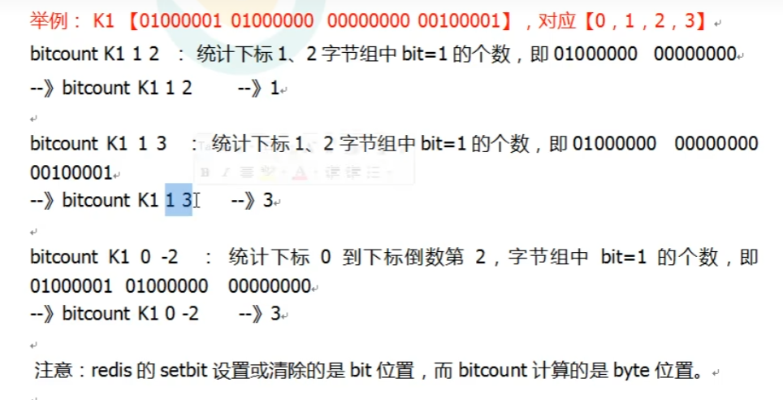

| 命令                                     | 作用                                                         | 实例 |
| ---------------------------------------- | ------------------------------------------------------------ | ---- |
| bitop and(or/not/xor) destkey  key [key] | bitop是一个复合操作，可以做交集，并集，非，异或将操作结果保存至destkey中 |      |
|                                          |                                                              |      |
|                                          |                                                              |      |


## 6.2 HyperLogLog

### 6.2.1 简介

```
基数统计
基数统计(Cardinality Counting) 通常是用来统计一个集合中不重复的元素个数，例如统计网站上每个网页的 UV(独立访客，每个用户每天只记录一次)

如果统计 PV(浏览量，用户没点一次记录一次)，给每个页面配置一个独立的 Redis 计数器就可以了，把这个计数器的 key 后缀加上当天的日期。这样每来一个请求，就执行 INCRBY 指令一次，最终就可以统计出所有的 PV 数据了。

但是 UV 不同，同一个用户一天之内的多次访问请求只能计数一次。这就要求了每一个网页请求都需要带上用户的 ID，无论是登录用户还是未登录的用户，都需要一个唯一 ID 来标识。

可以为每一个页面设置一个独立的 set 集合来存储所有当天访问过此页面的用户 ID。

但是如果网站访问量一大，你需要用来存储的 set 集合就会非常大，同时聚合统计起来非常复杂。
```


### 6.2.2 命令

| 命令                          | 作用                        | 实例                                 |
| ----------------------------- | --------------------------- | ------------------------------------ |
| pfadd key element element     | 添加指定元素到HyperLogLog中 | [15]> pfadd k5 1 2 3<br/>(integer) 1 |
| pfcount key                   | 统计基数数量                | [15]> pfcount k5<br/>(integer) 3     |
| pfmerge destkey key1 key2。。 | 合并到destkey中             |                                      |


## 6.3Genspatial

### 6.3.1 简介

```
Redis 3.2中增加了对GEO类型的支持。GEO , Geographic，地理信息的缩写。该类型，就是元素的2维坐标，在地图上就是经纬度。redis 基于该类型，提供了经纬度设置，查询，范围查询，距离查询，经纬度Hash等常见操作。v

```


### 6.3.2 命令

| 命令                                                  | 作用                     | 实例                                                    |
| ----------------------------------------------------- | ------------------------ | ------------------------------------------------------- |
| geoadd key longitude latitude member                  | 增加(精度,维度,名称)     | [15]> geoadd china 124 37 xx<br/>(integer) 1            |
| geopos key member                                     | 获取                     | [15]> geopos china  xx<br/>1) 1) "124.<br/>2) "37.0000" |
| geodist key member1，member2 [m\|km\|mi\|ft]          | 得到两位置的直线距离     |                                                         |
| georadius key longitude latitude radius m\|km\|mi\|ft | 找到给定精度半径内的位置 |                                                         |

```
两级无法直接添加
有效的精度从-180度到180度。有效维度从-85.05112878度到85.05112878
已经添加的数据，是无法再次添加的
```


# 7、Jedis操作Redis


## 7.1 Jedis所需要的jar

```xml
<dependency>
	<groupId>redis.clients</groupId>
	<artifactId>jedis</artifactId>
	<version>3.3.0</version>
</dependency>
```

## 7.2 连接

```java
public class JedisTest {
    public static void main(String[] args) {
        //创建Jedis对象
        //public Jedis(String host, int port)
//        String host = "192.168.0.103";
        String host = "127.0.0.1";
        int port = 6379;
        Jedis jedis = new Jedis(host,port);

        //测试
        String ping = jedis.ping();//PONG
        //如果可以连接上,ping()会返回一个值
        System.out.println(ping);
    }
}
```


## 7.3操作

```java
//操作key
    @Test
    public void test1(){
        jedis.select(15);//切换数据库
        Set<String> keys = jedis.keys("*");//获取所以key
        for (String key: keys) {
            System.out.println(key);
        }
    }
```

...

```
操作方法和终端命令基本一样，就不一一操作了
```


# 8、SpringBoot整合Redis


## 8.1 依赖配置

```xml
<dependency>
            <groupId>org.springframework.boot</groupId>
            <artifactId>spring-boot-starter-data-redis</artifactId>
        </dependency>
<!--        spring集成redis需要commons-pool2-->
        <dependency>
            <groupId>org.apache.commons</groupId>
            <artifactId>commons-pool2</artifactId>
            <version>2.6.0</version>
        </dependency>
```


## 8.2 yaml配置

```yml
  redis:
    host: 127.0.0.1
    port: 6379
    database: 0
    timeout: 1800000 # 超时时间毫秒
    lettuce:
      pool:
        max-active: 20 # 最大连接数
        max-wait: -1 #最大阻塞时间
        max-idle: 5 # 连接池最大空闲连接
        min-idle: 0
        
```

## 8.3 RedisConfig配置

```java
package com.local.dhf.bootredis.config;

import com.fasterxml.jackson.annotation.JsonAutoDetect;
import com.fasterxml.jackson.annotation.PropertyAccessor;
import com.fasterxml.jackson.databind.ObjectMapper;
import org.springframework.cache.CacheManager;
import org.springframework.cache.annotation.EnableCaching;
import org.springframework.context.annotation.Bean;
import org.springframework.context.annotation.Configuration;
import org.springframework.data.redis.cache.RedisCacheConfiguration;
import org.springframework.data.redis.cache.RedisCacheManager;
import org.springframework.data.redis.connection.RedisConnectionFactory;
import org.springframework.data.redis.core.RedisTemplate;
import org.springframework.data.redis.serializer.Jackson2JsonRedisSerializer;
import org.springframework.data.redis.serializer.RedisSerializationContext;
import org.springframework.data.redis.serializer.RedisSerializer;
import org.springframework.data.redis.serializer.StringRedisSerializer;

import java.time.Duration;

@Configuration
@EnableCaching
public class RedisConfig extends CachingConfigurerSupport {

    /**
     * 设置RedisTemplate规则
     *
     */
    @Bean
    public RedisTemplate<Object, Object> redisTemplate(RedisConnectionFactory redisConnectionFactory) {
        RedisTemplate<Object, Object> redisTemplate = new RedisTemplate<>();
        redisTemplate.setConnectionFactory(redisConnectionFactory);
        Jackson2JsonRedisSerializer jackson2JsonRedisSerializer = new Jackson2JsonRedisSerializer(Object.class);

        //解决查询缓存转换异常的问题
        ObjectMapper om = new ObjectMapper();
        // 指定要序列化的域，field,get和set,以及修饰符范围，ANY是都有包括private和public
        om.setVisibility(PropertyAccessor.ALL, JsonAutoDetect.Visibility.ANY);
        // 指定序列化输入的类型，类必须是非final修饰的，final修饰的类，比如String,Integer等会跑出异常
        om.enableDefaultTyping(ObjectMapper.DefaultTyping.NON_FINAL);
        jackson2JsonRedisSerializer.setObjectMapper(om);

        //序列号key value
        redisTemplate.setKeySerializer(new StringRedisSerializer());
        redisTemplate.setValueSerializer(jackson2JsonRedisSerializer);
        redisTemplate.setHashKeySerializer(new StringRedisSerializer());
        redisTemplate.setHashValueSerializer(jackson2JsonRedisSerializer);

        redisTemplate.afterPropertiesSet();
        return redisTemplate;
    }

    /**
     * 设置CacheManager缓存规则
     *
     */
    @Bean
    public CacheManager cacheManager(RedisConnectionFactory factory) {
        RedisSerializer<String> redisSerializer = new StringRedisSerializer();
        Jackson2JsonRedisSerializer jackson2JsonRedisSerializer = new Jackson2JsonRedisSerializer(Object.class);

        //解决查询缓存转换异常的问题
        ObjectMapper om = new ObjectMapper();
        om.setVisibility(PropertyAccessor.ALL, JsonAutoDetect.Visibility.ANY);
        om.enableDefaultTyping(ObjectMapper.DefaultTyping.NON_FINAL);
        jackson2JsonRedisSerializer.setObjectMapper(om);

        // 配置序列化（解决乱码的问题）,过期时间600秒
        RedisCacheConfiguration config = RedisCacheConfiguration.defaultCacheConfig()
                .entryTtl(Duration.ofSeconds(600))
                .serializeKeysWith(RedisSerializationContext.SerializationPair.fromSerializer(redisSerializer))
                .serializeValuesWith(RedisSerializationContext.SerializationPair.fromSerializer(jackson2JsonRedisSerializer))
                .disableCachingNullValues();

        RedisCacheManager cacheManager = RedisCacheManager.builder(factory)
                .cacheDefaults(config)
                .build();
        return cacheManager;
    }
}
```

## 8.4 测试

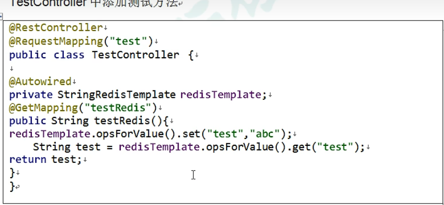


## 8.5 Redis连接池

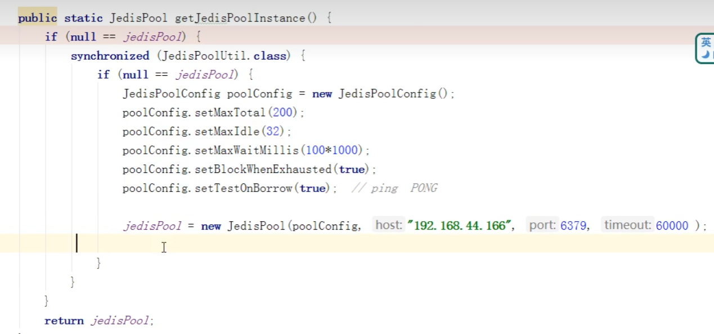


# 9、Redis事务操作


## 9.1 事务定义

```
Redis 事务是一个单独的隔离操作：事务中的所有命令都会序列化、按顺序地执行。事务在执行的过程中，不会被其他客户端发送来的命令请求所打断。

Redis 事务的主要作用就是串联多个命令防止别的命令插队。
```

## 9.2 Multi，Exec，discard

```
Redis 事务中有 Multi、Exec 和 discard 三个指令，在 Redis 中，从输入 Multi 命令开始，输入的命令都会依次进入命令队列中，但不会执行，直到输入 Exec 后，Redis 会将之前的命令队列中的命令依次执行。而组队的过程中可以通过 discard 来放弃组队。

```

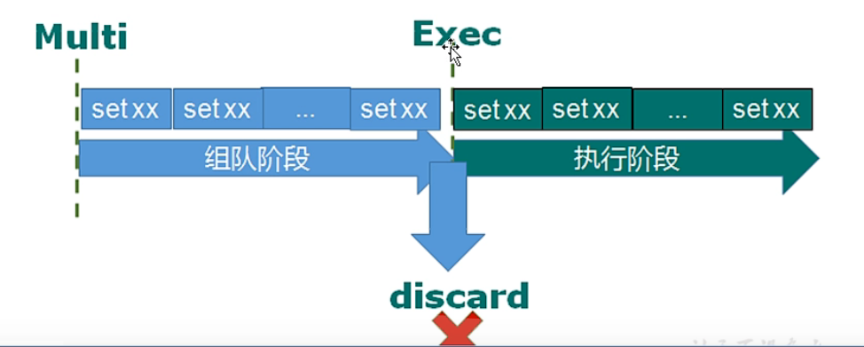

## 9.3 操作

```
127.0.0.1:6379[15]> keys *
(empty list or set)
127.0.0.1:6379[15]> multi 【开始排队】
OK
127.0.0.1:6379[15]> set k1 v1
QUEUED
127.0.0.1:6379[15]> set k2 v2
QUEUED
127.0.0.1:6379[15]> exec 【执行】
1) OK
2) OK
127.0.0.1:6379[15]> multi
OK
127.0.0.1:6379[15]> set k3 v3
QUEUED
127.0.0.1:6379[15]> set k4 v4
QUEUED
127.0.0.1:6379[15]> DISCARD 【放弃排队】
OK
127.0.0.1:6379[15]> keys *
1) "k2"
2) "k1"
127.0.0.1:6379[15]>
```


## 9.4 事务的错误处理

```
【1】组队中某个命令出错，整个命令都会失败
【2】执行阶段某个命令失败，只有出现错误的命令没有成功
```


## 9.5 事务冲突的问题

### 9.5.1 例子

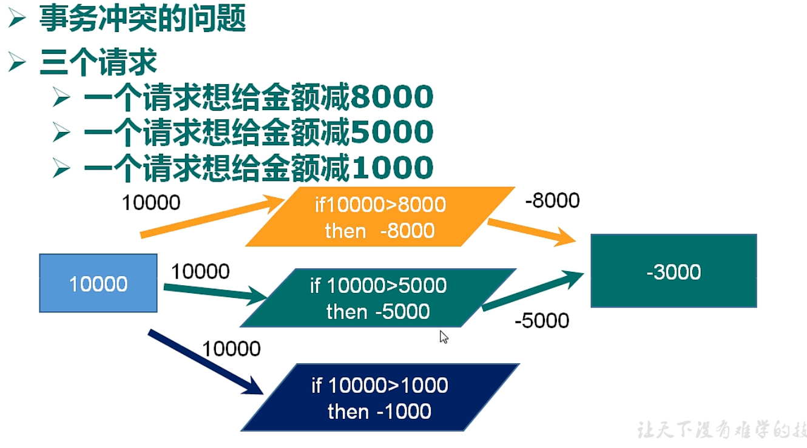


### 9.5.2 悲观锁

```
悲观锁 (Pessimistic Lock)，顾名思义，就是很悲观，每次去拿数据的时候都认为别人会修改，所以每次在拿数据的时候都会上锁，这样别人想拿这个数据就会 block 直到它拿到锁。传统的关系型数据库里边就用到了很多这种锁机制，比如行锁，表锁等，读锁，写锁等，都是在做操作之前先上锁。

```


### 9.5.3 乐观锁

```
乐观锁 (Optimistic Lock)，顾名思义，就是很乐观，每次去拿数据的时候都认为别人不会修改，所以不会上锁，但是在更新的时候会判断一下在此期间别人有没有去更新这个数据，可以使用版本号等机制。乐观锁适用于多读的应用类型，这样可以提高吞吐量。Redis 就是利用这种 check-and-set 机制实现事务的

```


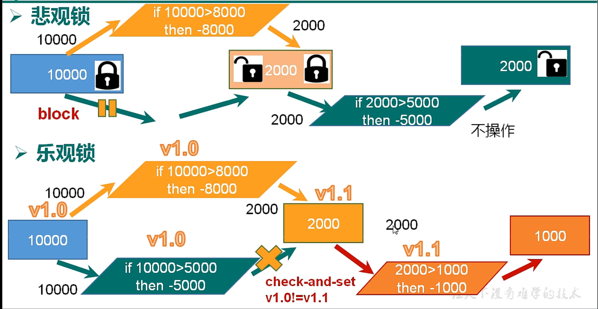


### 9.5.4 WATCH key [key...] 乐观锁使用

```
在执行 multi 之前，先执行 watch key1 [key2]，可以监视一个 (或多个) key ，如果在事务执行之前这个 (或这些) key 被其他命令所改动，那么事务将被打断。【乐观锁】
```

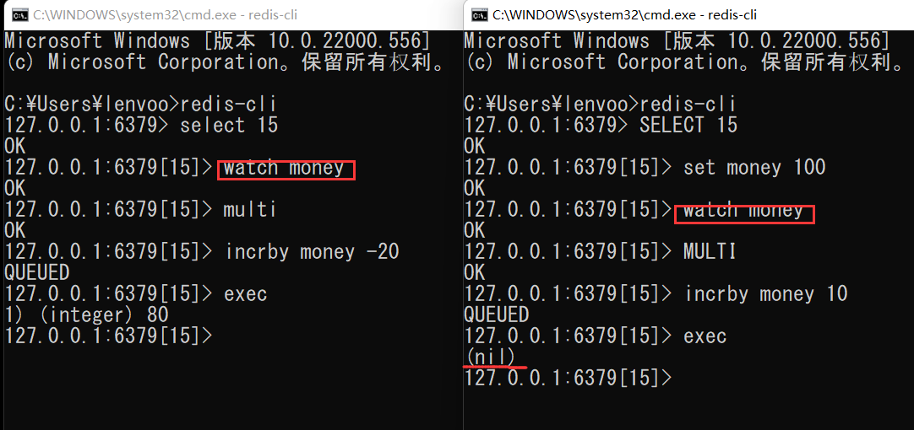


### 9.5.5 unwatch

```
取消 WATCH 命令对所有 key 的监视。如果在执行 WATCH 命令之后，EXEC 命令或 DISCARD 命令先被执行了的话，那么就不需要再执行 UNWATCH 了。

```


## 9.6 Redis事务三特性


- 单独的隔离操作 ：事务中的所有命令都会序列化、按顺序地执行。事务在执行的过程中，不会被其他客户端发送来的命令请求所打断。


- 没有隔离级别的概念 ：队列中的命令没有提交之前都不会实际被执行，因为事务提交前任何指令都不会被实际执行。


- 不保证原子性 ：事务中如果有一条命令执行失败，其后的命令仍然会被执行，没有回滚 。


# 10、 乐观锁库存遗留问题


[【尚硅谷】Redis 6 入门到精通 超详细 教程_哔哩哔哩_bilibili](https://www.bilibili.com/video/BV1Rv41177Af?p=27&spm_id_from=pageDriver&vd_source=89e1483a09cf66d32be9fddfdd8e2f35)


# 11、Redis持久化之RDB

## 11.1 介绍

```
Redis的数据存储在内存中，持久化是将内存中的信息保存到硬盘中
```

- **RDB**方式
- **AOF**方式

## 11.2 RDB

### 11.2.1 RDB是什么

```
在指定的时间间隔内将内存中的数据集快照写入磁盘，也就是行话讲的Snapshot快照，他恢复时是将快照文件直接读到内存中
```


### 11.2.2 备份如何让执行

​		Redis.会单独创建( fork )一个子进程来进行持久化，会先将数据写入到一个临时文件中，待持久化过程都结束了，再用这个临时文件替换上次持久化好的文件。整个过程中，主进程是不进行任何IO操作的，这就确保了极高的性能如果需要进行大规模数据的恢复，且对于数据恢复的完整性不是非常敏感，那RDB方式要比AOF方式更加的高效。**RDB的缺点是最后一次持久化后的数据可能丢失。**


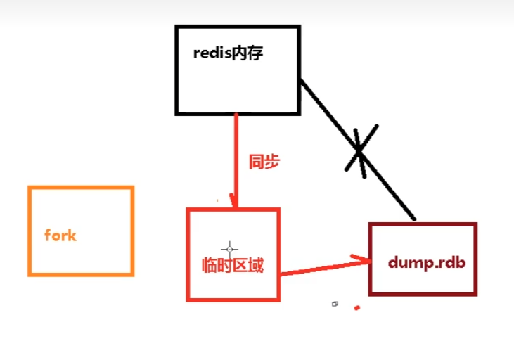

### 11.2.3 Fork

- Fork的作用是**复制一个与当前进程一样的进程**。新进程的所有数据（变量、环境变量、程序计数器等）数值都和原进程一致，但是是一个全新的进程，并作为原进程的子进程
- 在Linux程序中，fork会产生一个和父进程完全相同的子进程，但子进程在此后多会exec系统调用，出于效率考虑，Linux 中引入了“**写时复制技术**”
- 一般情况**父进程和子进程会共用同一段物理内存**，只有进程空间的各段的内容要发生变化时，才会将父进程的内容复制一份给子进程。


### 11.2.4 RDB持久化流程

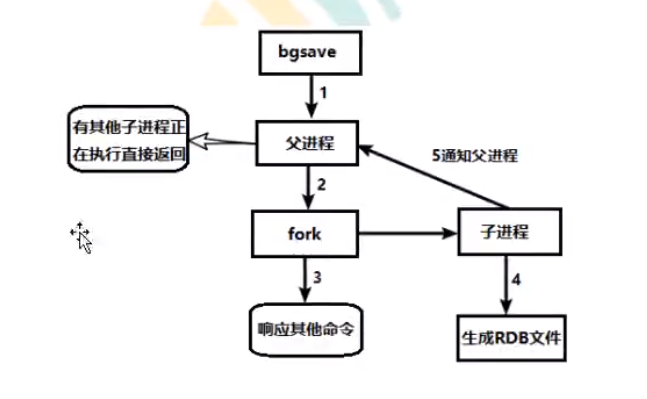


### 11.2.5 dump.rdb文件


在redis.config中配置文件名称，默认为dump.rdb

```
# 当启用了RDB且最后一次后台保存数据失败，Redis是否停止接收数据。
stop-writes-on-bgsave-error yes
...
# 对快照是否进行压缩存储
rdbcompression yes
...
# 完整性检查
rdbchecksum yes
...
# The filename where to dump the DB
dbfilename dump.rdb
...
dir ./
```


### 11.2.6 命令save，bgsave

- save：save只管保存，其他不管，全部阻塞。手动保存，不建议
- **bgsave：Redis会在后台异步进行快照操作，快照同时还可以响应客户端请求**
- 可以通过**lastsave**命令获取最后一次成功执行快照的时间


### 11.2.7 劣势

- Fork的时候，内存中的数据被克隆了一份，大致2倍的膨胀性需要考虑
- 虽然 Redis,在fork时使用了写时拷贝技术,但是如果数据庞大时还是比较消耗性能。
- 在备份周期在一定间隔时间做一次备份，所以如果 Redis.,意外down掉的话，就会丢失最后一次快照后的所有修改。

### 11.2.8 优势

- 适合大规模的数据恢复
- 对数据完整性和一致性要求不高更适合使用
- **节省磁盘空间**
- **恢复速度更快**


### 11.2.9 rdb备份


- 先通过config get dir查询rdb文件的目录
- 将*.rdb.的文件拷贝到别地方
- rdb的恢复
  - 关闭 Redis.
  - 先把备份的文件拷贝到工作目录下cp dump2.rdb dump.rdlb
  - 启动Redis,备份数据会直接加载


# 12、Redis持久化AOF

## 12.1 是什么


​		以日志的形式来记录每个**写操作**(增量保存），将Redis执行过的所有写**指令记录**下来(读操作不记录)，**只许追加文件但不可以改写文件**，redis启动之初会读取该文件重新构建数据，换言之，redis重启的话就根据日志文件的内容将写指令从前到后执行一次以完成数据的恢复工作。


## 13.2 AOF持久化流程

```
(1)客户端的请求写命令会被append追加到AOF缓冲区内;
(2) AOF缓冲区根据AOF持久化策略[alwgays,everysec,no]将操作sync同步到磁盘的AOF文件中;
(3) AOF文件大小超过重写策略或手动重写时，会对AOF文件 rewrite重写，压缩AOF文件容量;
(4)Redis服务重启时，会更新load加载AOF文件中的写操作达到数据恢复的目的
```


### 13.3.1 AOF默认不开启

```
# 开启AOF持久化策略
appendonly yes

# AOF生成的文件名
appendfilename "appendonly.aof"

rdb和aof的生成路径一样
```


```
AOF和RDB同时开启，系统默认取AOF数据
```


### 13.3.2 AOF启动/修复/恢复


```
redis-check-aof --fix filename 异常修复
```


### 13.3.3 AOF同步频率设置

- **appendfsync always**

始终同步，每次Redis 的写入都会立刻记入日志;性能较差但数据完整性比较好

- s**appendfsync everysecr**

每秒同步，每秒记入日志一次，如果宕机，本秒的数据可能丢失。

- **vappendfsync no**

redis不主动进行同步，把同步时机交给操作系统。·


### 13.3.4 优势

- 备份机制更稳健，丢失数据概率更低
- 可读的日志文件，通过操作AOF稳健，可以处理误操作


### 13.3.5 劣势

- 比起RDB占用更多空间
- 恢复备份数据速度要慢
- 每次读写都同步的化，有一定的性能压力
- 存在个别bug，造成恢复不能


### 13.3.6 Rewrite操作

```
重写压缩操作
```


```
AOF采用文件追加方式，文件会越来越大为避免出现此种情况，新增了重写机制,当AOF文件的大小超过所设定的阈值时，Redis就会启动AOF文件的内容压缩，只保留可以恢复数据的最小指令集.可以使用命令bgrewriteaof.

```

**原理**


```
AOF文件持续增长而过大时，会fork出一条新进程来将文件重写(也是先写临时文件最后再rename) , redis4.0版本后的重写，是指上就是把 rdb 的快照，以二级制的形式附在新的aof头部，作为已有的历史数据，替换掉原来的流水账操作。·
no-appendfsync-on-rewrite 

```


**触发机制，何时重写**

```
AOF文件大于64M的100% =>>>   128M 才会重写
```


**重写流程**

( 1 ) bgrewriteaof触发重写，判断是否当前有bgsave或bgrewriteaof在运行，如果有，则等待该命令结束后再继续执行。”
(2)主进程fork出子进程执行重写操作，保证主进程不会阻塞。。
( 3 )子进程遍历redis内存中数据到临时文件，客户端的写请求同时写入aof_buf缓冲区和aof_rewrite_buf重写缓冲区保证原AOF文件完整以及新AOF文件生成期间的新的数据修改动作不会丢失。”
( 4) 1).子进程写完新的AOF文件后，向主进程发信号，父进程更新统计信息。2).主进程把aof_rewrite_buf中的数据写入到新的AOF文件。”
(5)使用新的AOF文件覆盖旧的AOF文件，完成AOF重写。“


# 14、Redis主从复制


## 14.1 简介

```
主机数据更新后根据配置和策略，自动同步到master/slaver机制，Master以写为主，Slaver以读为主
```


## 14.2 作用

- 读写分离，性能扩展
- 容灾快速恢复

```
主从复制：【一主多从】
只能由一个主(master)服务器，多台从(Slaver)服务器
```


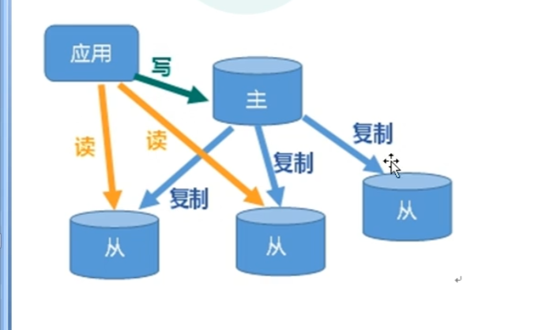


## 14.3 搭建一主多从

```
1、复制redis.conf配置文件

2、一主多从要分别使用不同的端口【在同一台计算机上】

3、创建一主两从，创建三个配置文件
	redis6379.conf
	redis6380.conf
	redis6381.conf

4、三个配置文件中分别写入内容
	redis6379.conf
        #引入redis.conf配置文件
        inlucde /../redis.conf # 找到redis.conf的路径
        pidfile redis6379.pid # 写路径
        port 6379
        dbfilename dump6379.rdb # rdb文件名称
    redis6380.conf
        #引入redis.conf配置文件
        inlucde /../redis.conf # 找到redis.conf的路径
        pidfile redis6380.pid # 写路径
        port 6380
        dbfilename dump6380.rdb # rdb文件名称
    redis6381.conf
        #引入redis.conf配置文件
        inlucde /../redis.conf # 找到redis.conf的路径
        pidfile redis6381.pid # 写路径
        port 6381
        dbfilename dump6381.rdb # rdb文件名称
【或者直接复制redis.conf，然后再配置上修改port ...
修改slaveof ... 】	
5、关闭AOF
	appendonly no

6、启动三台redis服务器
	redis-server redis6379.windows.conf
	redis-server redis6380.windows.conf
	redis-server redis6381.windows.conf

7、查看当前主机运行情况
127.0.0.1:6379> info replication
# Replication
role:master 【主服务器】
connected_slaves:0 【从服务器0】


7、配从不配主
slaveof <主机ip> <主机port>
在从机上执行slaveof，将从机加到主机上
```


## 14.4 常见问题

【1】**某台 从 服务器挂掉**

```
某台从服务器挂掉后，再次重新启动，加入从服务器，他会将主服务器中的数据全部复制过来
```


【2】**主 服务器挂掉**

```
主服务器重启后，启动后，他还是master，从服务器会捕捉到这个事情
```


【**薪火相传**】

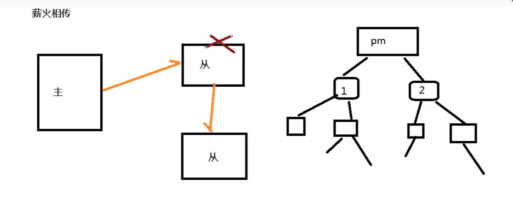

```
将一个从服务器变成另一个从服务的从服务器
slaveof <从服务器ip><port>
```


【反客为主】

```
当一台主服务器宕机，由一台从服务变成主服务器
slaveof no one【将一个从服务器变成主服务器】
```


## 14.5 复制原理

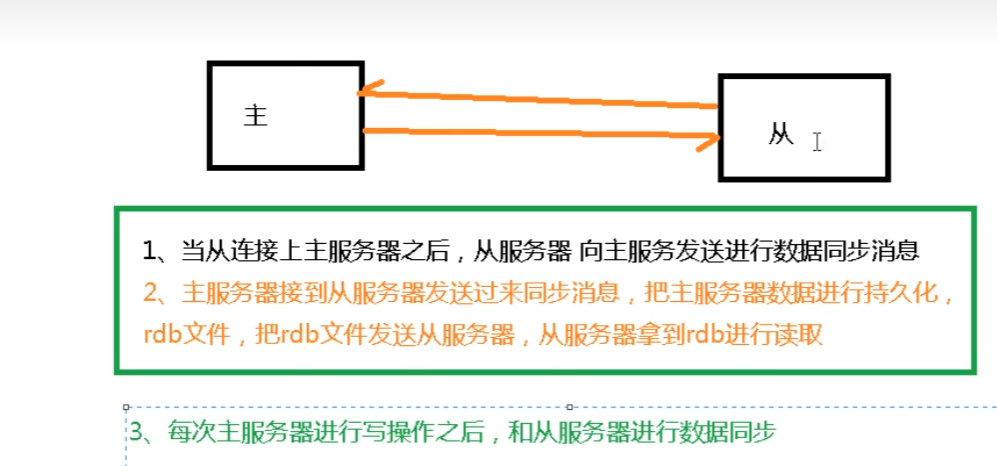


## 14.6 哨兵模式


### 14.6.1 简介

```
反客为主的自动版，能够后台监控主机是否故障，如果故障了根据投票数自动将从库转换为主控
```


### 14.6.2 配置

```
【1】新建sentinel.conf配置文件
【2】在sentinel中，写
	sentinel monitor redis_6379 127.0.0.1 6379 1
其中,redis_6379为建卡对象起的服务器名称，1为至少由多少个哨兵同意

```


### 14.6.3 启动哨兵

```
【3】使用redis-sentinel sentinel.conf启动
```

当主机挂掉后，哨兵自动选举处新的master

当挂掉的主机重新启动，原来的主服务器会变成slaver


### 14.6.4 复制延时

```
由于所有的写操作都是先在Master上操作，然后同步更新到slave上，所以从Master同步到slave机器有一定的延迟，当系统很繁忙的时候，延迟问题会更加严重，Slave机器数量的增加也会使这个问题更加严重。
```


### 14.6.5 故障修复


```
replica-priority # 100 优先级
```


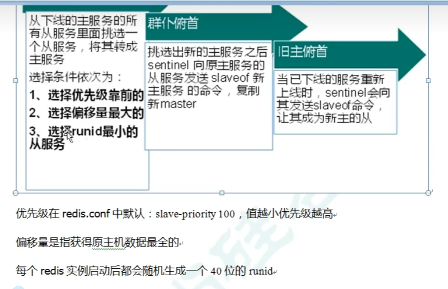


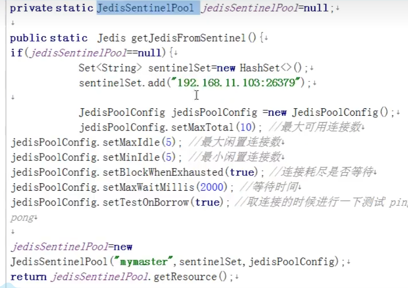


# 15、 Redis集群

## 15.1 简介

```
容量不够，redis如何进行扩容
并发写操作，redis 如何分摊？
另外，主从模式，薪火相传模式，主机宕机，导致ip地址发生变化，应用程序中配置需要修改对应的主机地址、端口等信息。
之前通过代理主机来解决，但是 redis3.0中提供了解决方案。就是无中心化集群配置。

```


## 15.2 集群是什么

```
Redis 集群（包括很多小集群）实现了对 Redis 的水平扩容，即启动 N 个 redis 节点，将整个数据库分布存储在这 N 个节点中，每个节点存储总数据的 1/N，即一个小集群存储 1/N 的数据，每个小集群里面维护好自己的 1/N 的数据。

Redis 集群通过分区（partition）来提供一定程度的可用性（availability）： 即使集群中有一部分节点失效或者无法进行通讯， 集群也可以继续处理命令请求。

该模式的 redis 集群特点是：分治、分片。
```


### 15.3 问题

- 容量不够，redis 如何进行扩容？


- 并发写操作， redis 如何分摊？


- 另外，主从模式，薪火相传模式，主机宕机，导致 ip 地址发生变化，应用程序中配置需要修改对应的主机地址、端口等信息。


- 之前通过代理主机来解决，但是 redis3.0 中提供了解决方案。就是无中心化集群配置。


## 15.4 redis搭建

### 15.4.1 redis cluster 配置修改

```
cluster-enable yes 打开集群模式
cluster-config-file nodes-6379.conf 设置结点配置文件名
cluster-node-timeout 15000 设置结点失联时间，超过该时间，集群自动进行主从切换
```

```
include redis.conf
pidfile /var/run/redis_6379.pid
port 6379
dbfilename dump6379.rdb

cluster-enabled yes 
cluster-config-file nodes-6379.conf 
cluster-node-timeout 15000
```

```
启动服务后产生多个结点 node-xxx.conf
```


### 15.4.2 将多个结点合成集群

```
redis-cli --cluster create --cluster-replicas 1 host:ip host:ip host:ip ...
```


```
[root@dhfEdu redis_cluster]# redis-cli --cluster create --cluster-replicas 1 127.0.0.1:6379 127.0.0.1:6380 127.0.0.1:6381 127.0.0.1:6389 127.0.0.1:6391 127.0.0.1:6392
>>> Performing hash slots allocation on 6 nodes...
Master[0] -> Slots 0 - 5460
Master[1] -> Slots 5461 - 10922
Master[2] -> Slots 10923 - 16383
Adding replica 127.0.0.1:6391 to 127.0.0.1:6379
Adding replica 127.0.0.1:6392 to 127.0.0.1:6380
Adding replica 127.0.0.1:6389 to 127.0.0.1:6381

```


### 15.4.3 集群方式连接

```
redis-cli -c -p port
```


### 15.4.4 查看集群结点信息

```
cluster nodes
```

```
127.0.0.1:6379> cluster nodes
74d108c76abd9cac772c3e721a557f79352c5e12 127.0.0.1:6389@16389 slave 7a19dd2927f1893cb95534c91c1ece10a903da31 0 1657264336125 1 connected
7a19dd2927f1893cb95534c91c1ece10a903da31 127.0.0.1:6379@16379 myself,master - 0 1657264337000 1 connected 0-5460
679f0eb1c81d432007890333dded4fbb76694d6d 127.0.0.1:6380@16380 master - 0 1657264338144 2 connected 5461-10922
497348ceb17c00b05a3104294a4020ffa8c0298c 127.0.0.1:6391@16391 slave 679f0eb1c81d432007890333dded4fbb76694d6d 0 1657264336000 2 connected
5ca05cc74b0e69fc26a463fb7ae080c01c40d372 127.0.0.1:6392@16392 slave 9abdc9c20099c36ec85bd1492a7aba932ef3e6ee 0 1657264334000 3 connected
9abdc9c20099c36ec85bd1492a7aba932ef3e6ee 127.0.0.1:6381@16381 master - 0 1657264337135 3 connected 10923-16383

```


```
一个集群至少有 3 个结点
分配原则是保证每个主数据库在不同的ip地址，每个从库和主库不在一个ip上
```


## 15.5 什么是slots(插槽)

```
[OK] All 16384 slots covered.
```

```
一个Redis集群包含16384个插槽，每个键都是插槽中的一个
根据 key 计算插槽位置，将其值放入进去
为了将 数据平均分摊到 各个主机
一个插槽可以有多个值
```

```
127.0.0.1:6379> set k1 v1【计算的插槽是12706位于6381】
-> Redirected to slot [12706] located at 127.0.0.1:6381
OK
【
该k-v会加入6381，如果6381原来就有k1,则会覆盖原来6381的值
在6379使用 keys *
不会查到k1，但是使用get会得到信息6381中的k-v
】
```

**【加入多个值】**

```
无法直接算多个值的slot
```

```
使用 组 的概念，将多个值分成一个组
使用组去计算slot
mset k1{组} v1 k2{组} v2
```

```
127.0.0.1:6381> mset k2{me} v2 k3{me} v3
-> Redirected to slot [373] located at 127.0.0.1:6379
OK
127.0.0.1:6379> mset k4 v4 k5 v5
(error) CROSSSLOT Keys in request don't hash to the same slot

【获取】
127.0.0.1:6381> get k2
-> Redirected to slot [449] located at 127.0.0.1:6379
(nil)
127.0.0.1:6379> get k2{me}
"v2"
```

**【计算插槽值】**

```
clustre keyslot key
```

```
127.0.0.1:6379> cluster keyslot k1
(integer) 12706

```

**【计算插槽中的数】**

```
cluster countkeysinslot keyslot
```


## 15.6 故障修复


**【cluster-require-full-coverage】**

```
如果某一段插槽的主从都挂掉，而cluster-require-full-coverage为yes，那么整个集群都会挂掉
如果某一段插槽的主从都挂掉，而cluster-require-full-coverage为no，该插槽数据全不能使用，也无法存储

```


## 15.7 集群的Jedis开发

```
Redis集群->无中心化->使用任何一个主机都可以连接到集群
```

```java

public static void main(String[] args){
	//创建对象
	HostAndPort hp = new HostAndPort("127.0.0.1",6379);
	JedisCluster jedisCluster = new JedisCluster(hp);
	
	//进行操作
	jedisCluster.set("k1","v1");
	
	String value = jedisCluster.get("k1");
	
	jedisCluster.close();

}
```


## 15.8 Redis集群好处

- 实现扩容
- 分摊压力
- 无中心化配置


## 15.9 Redis集群不足

- 多件操作不被支持
- 多间的Redis事务不被支持，lua脚本不被支持


# 16 Redis应用问题


## 16.1 缓存穿透

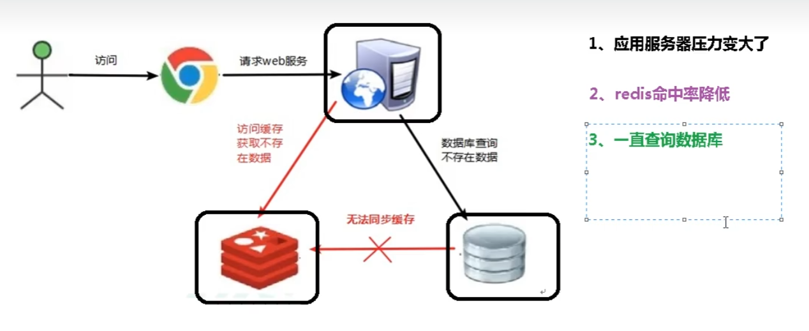


```
缓存中查不到，一直访问数据库，数据库压力太大，【缓存没有起到作用】
```

- Redis查询不到数据
- 出现了很多非正常的url访问【不是为了得到数据，只是为了增加压力】


### 16.1.1 解决方案

- **对空值进行缓存**：如果查询到返回的数据为空（不管数据是否存在），我们仍然把这个空结果（null）进行缓存，设置空结果的过期时间很短，最长不超过五分钟
- **设置可访问的名单（白名单）**：使用bitmap类型定义一个可以访问的名单，名单id作为bitmaps的偏移量，每次访问和bitmap里面的id进行比较，如果访问id不在bitmaps里面，进行拦截，不允许访问
- **采用布隆过滤器**：布隆过滤器（Bloom Filter）是1970年由布隆提出的。它实际上是一个很长的二进制向量和一系列随机映射函数。布隆过滤器可以用于检索一个元素是否在一个集合中。它的优点是空间效率和查询时间都比一般的算法要好的多，缺点是有一定的误识别率和删除困难。
- **进行实时监控**：当发现Redis的命中率开始急速下降，需要急速排查访问对象和访问的数据，和运维人员进行配合，可以设置黑名单限制服务


## 16.2 缓存击穿


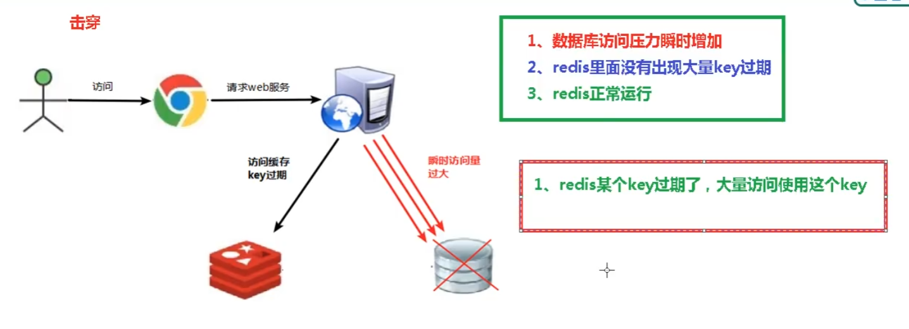


### 16.2.1 解决方案

```
	key可能会存在某个时间点被超高的并发访问，是一种非常 “热点” 的数据。这个时候要考虑一个问题：缓存被 “击穿” 的问题
```

- **预先设置热门数据**：在redis高峰访问之前，把一些热门数据提前存到redis里面，假发这些热门数据key的时长
- **实时调整**：现场监控哪些数据热门，实时调整key的过期时长
- **使用锁**：
  - 在缓存失效的时候（判断拿出来的值为空），不是立即去load db
  - 先使用缓存工具的某些带成功操作返回值的操作（比如Redis的SETNX）去set一个mutex key
  - 当操作返回成功时，再进行load db操作，并回设缓存，最后删除mutex key
  - 当操作返回失败，证明有现在再load db中，当前线程睡眠一段时间再重试整个get缓存的方法


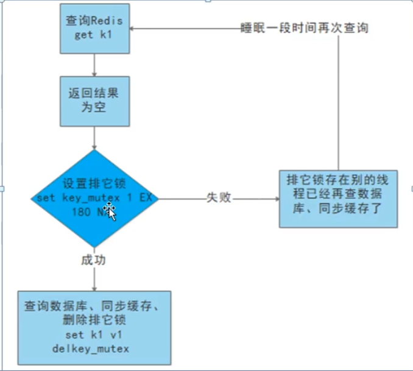


## 16.3 缓存雪崩

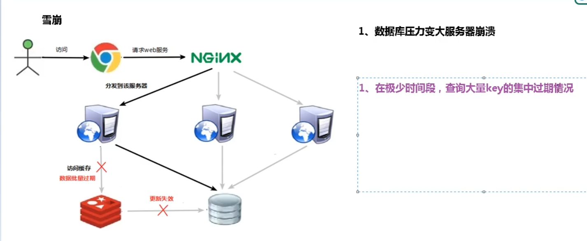


### 16.3.1 解决方案

- **构建多层缓存**：nginx缓存+redis缓存+其他缓存（ehcache等）
- **使用锁或队列**：用加锁或者队列的方式保证不会有大量的线程对数据库进行一次性读写，从而避免失效时大量的并发请求落到底层存储系统上，不适用高并发情况
- **设置过期标志更新缓存**：记录缓存数据是否过期（设置提前量），如果过期会触发另外的线程再后台去更新实际的key缓存
- **将缓存失效时间分散开**：每个缓存的过期时间重复率降低，就很难引发集体失效


## 16.4 分布式锁

### 16.4.1 问题描述

```
	随着业务发展的需要，原单体单机部署的系统被演化成分布式集群系统后，由于分布式系统多线程、多进程并且分布在不同机器上，这将使原单机部署情况下的并发控制锁策略失效，单纯的Java API并不能提供分布式锁的能力。为了解决这个问题就需要一种跨JVM的互斥机制来控制共享资源的访问，这就是分布式锁要解决的问题
```

```
一个锁对所有主机都生效
```

分布式锁主流的实现方案：

1. 基于数据库实现分布式锁
2. 基于缓存
3. 基于Zookeeper


### 16.4.2 基于Redis实现分布式锁

redis：命令

EX second：设置键的过期时间为second秒，SET key value EX second 效果等同于setnx key second value

```
127.0.0.1:6379> setnx key value【上锁】
(integer) 1
127.0.0.1:6379> setnx key value
(integer) 0
127.0.0.1:6379> setnx key value
(integer) 0
127.0.0.1:6379> del key【释放锁】
(integer) 1
127.0.0.1:6379> setnx key value
(integer) 1
```


```
优化：
	如果锁一直没有释放
	加上过期时间，expire key second
==>
上锁后，出现异常，无法设置过期时间
	一边上锁，一边上锁
		set key value nx ex 12【时间 second】
```

```
ttl key 查看锁时间
```


### 16.4.3 Java代码实现分布式锁、UUID防止误删

```
使用uuid防止误删；
```


```java

@Autowired
private RedisTemplate redisTemplate;
public void test(){
    //
    String uuid = UUID.randomUUID.toString();
    //获取锁
    Boolean lock = redisTemplate.opsForValue().setIfAbsent("lock",uuid,3,TimeUnit.Second);//设置过期时间
    //获取成功，获取key的值
    if(lock){
        Object value = redisTemplate.opsForValue().get("key");
        if(StringUtils.isEmpty(value)){//value为null
            return;
        }
        //有值，操作
        //...
        //操作完成，释放锁
        String lockid =  redisTemplate.opsForValue().get("lock");
        if(lockid == uuid){//自己的锁进行释放
            redisTemplate.delete("lock");
        }
        
    }else{//获取失败
        try{
            Thread.sleep(100);//等一会
            test();//重新获取
        }catch(Exception e){
         	throw e;   
        }finally{
            
        }
    }
}
```

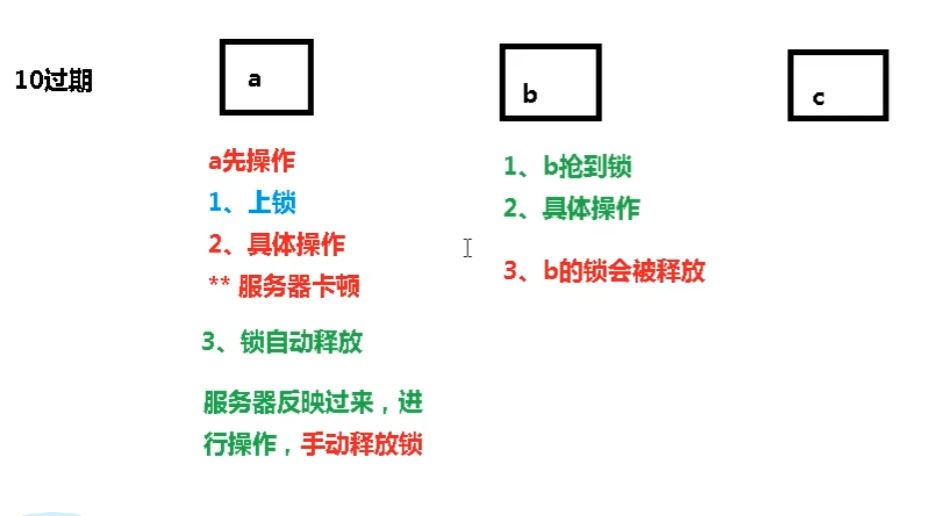


### 16.4.4 LUA脚本实现原子性操作


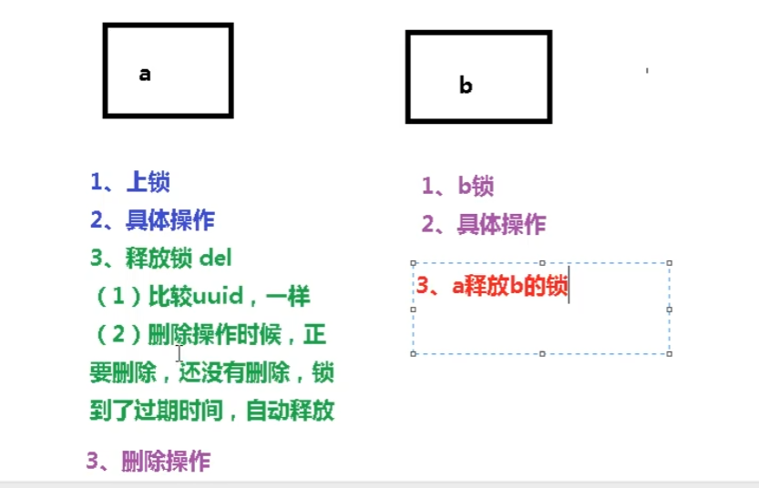


